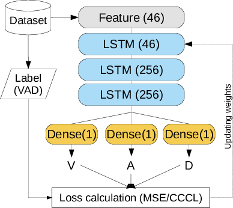

### *Evaluation of Error and Correlation-Based Loss Functions For Multitask Learning Dimensional Speech Emotion Recognition*

by
Bagus Tris Atmaja
Masato Akagi,
Email: bagus@ep.its.ac.id

> This is a repository for that paper that provide Python codes, Latex codes 
> figures, and other materials.

This paper has been submitted for publication in *APSIPA 2020*.



*Architecture of evaluated system.*


## Abstract

> The choice of a loss function is a critical part in machine learning. This 
paper evaluated two different loss functions commonly used in regression-task 
dimensional speech emotion recognition, an error-based and a correlation-based loss 
functions. We found that using correlation-based loss function with 
a concordance correlation coefficient (CCC) loss 
resulted better performance than error-based loss function with a mean squared error (MSE) loss, 
in terms of the averaged CCC score. The results are consistent with two input feature 
sets and two datasets. 
The scatter plots 
of test prediction by those two loss functions also confirmed the results 
measured by CCC scores.

## Software implementation

All source code used to generate the results and figures in the paper are in
the `code` folder.
The calculations and figure generation are all run from Python codes.
The data used in this study is provided in `data` and the sources for the
manuscript text and figures are in `manuscript`.
Results generated by the code are saved in `results`.
See the `README.md` files in each directory for a full description.


## Getting the code

You can download a copy of all the files in this repository by cloning the
[git](https://git-scm.com/) repository:

    git clone https://github.com/bagustris/ccc_mse_ser.git

or [download a zip archive](https://github.com/bagustris/ccc_mse_ser).


## Dependencies

You'll need a working Python environment to run the code.
The recommended way to set up your environment is through the
[Anaconda Python distribution](https://www.anaconda.com/download/) which
provides the `conda` package manager.
Anaconda can be installed in your user directory and does not interfere with
the system Python installation.
The required dependencies are specified in the file `requirements.txt`.

We use `pip` virtual environments to manage the project dependencies in
isolation.
Thus, you can install our dependencies without causing conflicts with your
setup (even with different Python versions).

Run the following command in the repository folder (where `environment.yml`
is located) to create a separate environment and install all required
dependencies in it:

    pip3.6 venv REPO_NAME


## Reproducing the results

Before running any code you must activate the conda environment:

    source activate REPO_NAME

To reproduce result in , run the following in order:  
```bash
```


## License

All source code is made available under a BSD 3-clause license. You can freely
use and modify the code, without warranty, so long as you provide attribution
to the authors. See `LICENSE.md` for the full license text.

The manuscript text is not open source. The authors reserve the rights to the
article content, which is currently submitted for publication in the
EUSIPCO 2020.


## Citation

``` 
B. T. Atmaja and M. Akagi, “Deep Multilayer Perceptrons for Dimensional Speech Emotion Recognition,” 
in 2020 Asia-Pacific Signal and Information Processing Association Annual Summit and Conference, 
APSIPA ASC 2020 - Proceedings, 2020, pp. 325–331.
```
